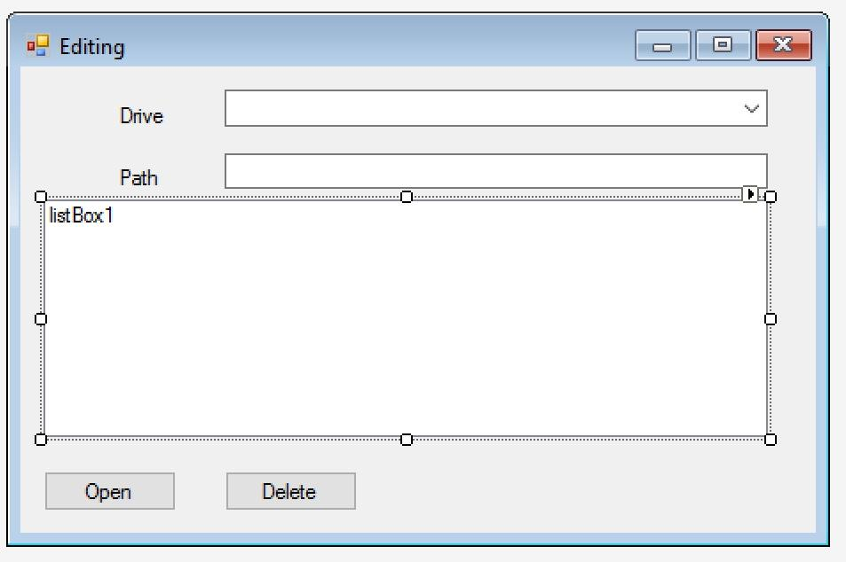

{1}

The "Driver" combobox should contain the drivers available on the computer (letter and type)!

{2}

In case of choosing one drive, the path of the root directory of the drive should appear in the field of "Path", and in the listbox the texts and the list of directories are meant to appear.

{3}

Create the event of clicking the "Open" that manages the operation, which in case of directory opens the selected directory, updates the path and makes the content of the directory (directories and texts) appear in the listbox. In case of a file the content of the selected file should appear in a chat window!

{4}

Create the event of clicking the "Delete" that manages the operation, which deletes the selected element!
